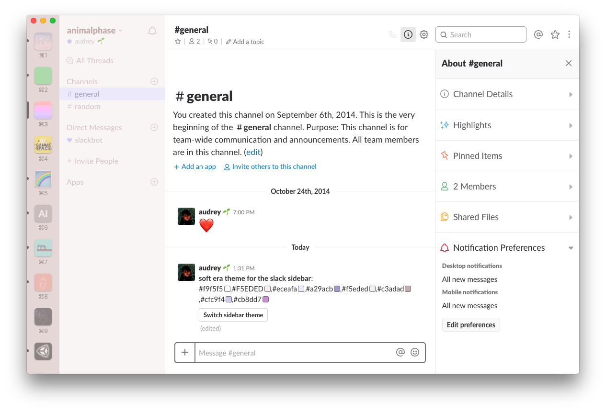

# \~ soft era \~

### syntax theme for [Slack](https://slack.com/)

🌸 Light pastel syntax theme for cozy, cute coding & typing. 🌱

---

🎨 **Hex values:**
```
#f9f5f5,#F5EDED,#eceafa,#a29acb,#f5eded,#c3adad,#cfc9f4,#cb8dd7
```



~.~
<br>&nbsp;&nbsp;a soft, warm, low contrast theme,
<br>&nbsp;&nbsp;with pastel accents that are easy on your eyes

^.^
<br>&nbsp;&nbsp;make stuff and learn.
<br>&nbsp;&nbsp;make the world your kinda place.
<br>&nbsp;&nbsp;take care of the people around you

## Installation

Instructions, as of time of writing:
- In Slack, go to **Preferences > Sidebar > Additional Options**
- In the bottom text field that says "Copy and paste these values to share your custom theme with others:", paste in the **hex values** listed above.
or
- In a Slack chat window, paste in the **hex values** listed above.
- Press Enter/Return to send the message.
- You message will be displayed with color previews, and a button to **Switch sidebar theme**!
  - Others can see this message. If you wish to do this privately, do it in a Direct Message to yourself or to a bot.

💾 enjoy <3

---

Happy to hear any input <3

💖 [@animalphase](https://twitter.com/animalphase) on twitter
